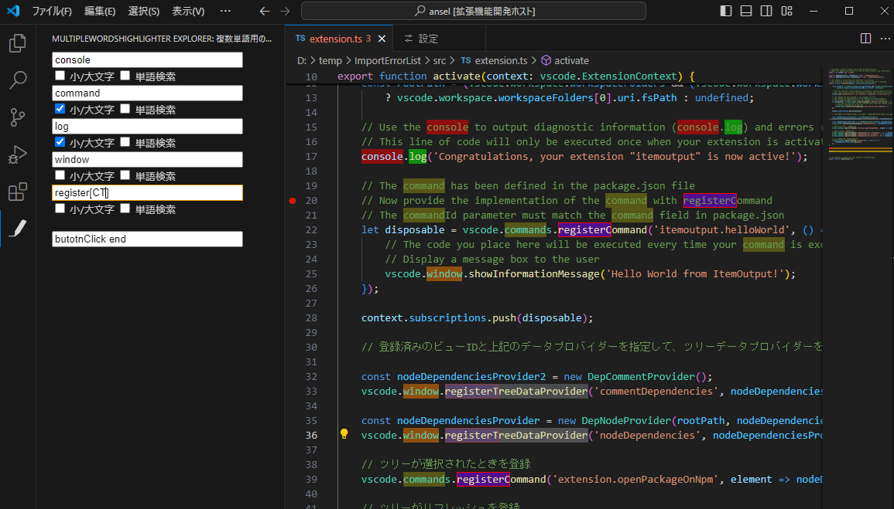
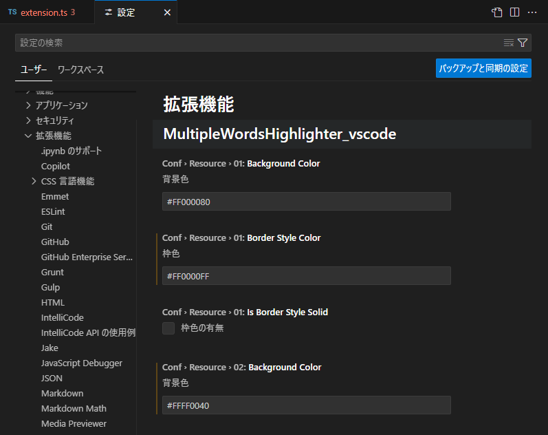
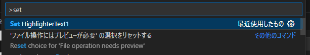

# multiplewordshighlighter-vscode README

複数の単語をマーカーして表示します

## Features

Activity Barに専用のボタンを追加し、マーカー用の画面を表示

InputBoxに記載すると、マーカーが画面に反映されます
基本は、大文字小文字同一、単語検索なし、正規表現となっています

色は設定画面より変更可能

キーボード派のためにコマンドパレットから"Set HighlighterText*"で登録可能

## Known Issues

多言語対応していません

日本語のみです

正規表現の有無のボタンを追加するかを検討中

単語数を5から8にするかを検討中

バーの下部が余っているため何かできないかを検討中

Activity Barの検索の中に含められないかを検討中

Sidebarsの長さを考慮できていない

